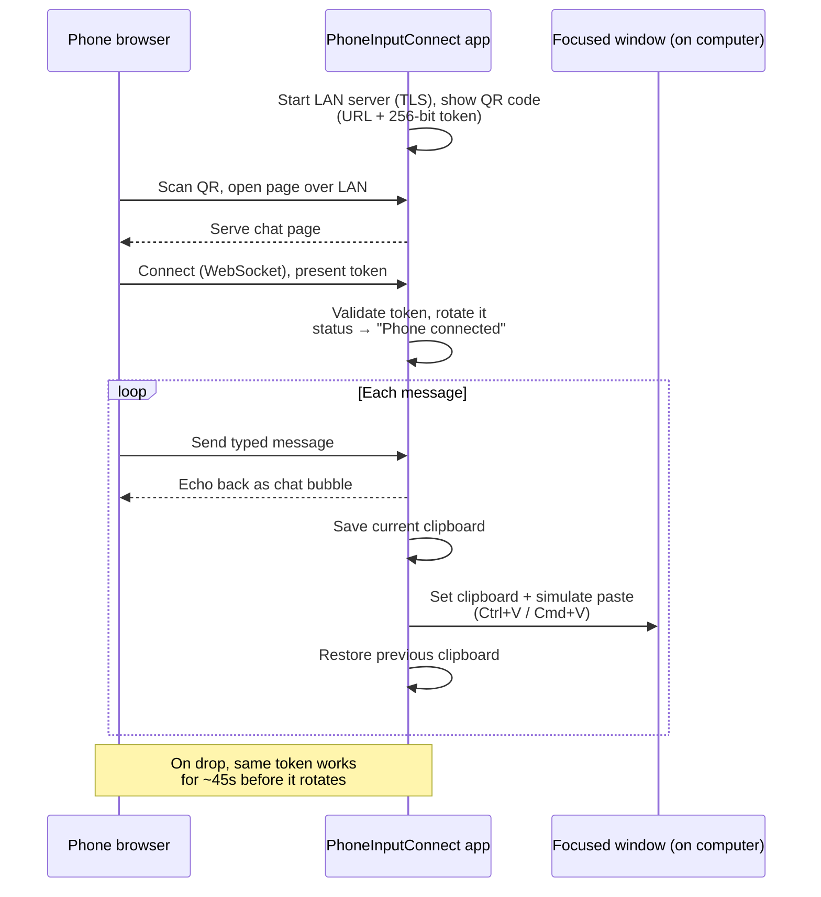

# PhoneInputConnect

Type on your desktop by texting it from your phone.

PhoneInputConnect runs as a small app on your computer. It shows a QR code; scan
it with your phone (same Wi-Fi network, no app install), type a message in
the page that opens, and it's instantly typed into whatever window has
focus on your desktop -- as if you'd typed it yourself.

**Platform status**: every platform opens a native window showing the QR
code/status/history on launch. On Linux it's a GTK4 window
(`src/window/linux.rs`); on Windows a `native-windows-gui`/Win32 window
(`src/window/windows.rs`); on macOS native AppKit widgets in a `winit` window
with a menu-bar icon (`src/tray/native.rs`, `src/tray/appkit_dashboard.rs`).
Closing the Linux/Windows window quits the app entirely, including the
pairing server; on macOS closing just hides the window (the menu-bar
icon's "Show window" brings it back, "Quit" exits). All three platforms'
windows have now been built and tested on real machines.

## Why

Typing on a phone keyboard is often faster or more comfortable than reaching
for a desktop keyboard -- e.g. dictating a note with the phone's speech-to-text,
pasting a password or 2FA code from a phone-based manager, sending an emoji or
CJK phrase your desktop IME fumbles, or entering text one-handed from across the
room. The phone is already in your hand, already unlocked, already set up with
your preferred keyboard, autocorrect, and dictation. PhoneInputConnect turns it
into an ad hoc keyboard for whatever window you're focused on -- with no
account, no cloud service, and no app to install.

**Where this sits in the bigger picture.** The core idea -- using your phone as
a wireless input method (an IME digitizer or a direct text relay) -- is no
longer exotic; it's becoming a standard ecosystem feature. Major platform
vendors are building the exact same mechanics straight into their desktop
operating systems: phone-to-desktop text hand-off, shared clipboard, and
continuity/handoff-style input all point at the same need this tool serves.

PhoneInputConnect's niche is deliberately narrower and different from those
built-in offerings:

- **Zero setup, no accounts.** No sign-in, no linked-devices dance, no vendor
  account on either end -- scan a QR code and type.
- **Cross-ecosystem.** It doesn't care that the phone and computer are from the
  same vendor. Any phone with a camera and browser talks to any desktop OS
  (Linux, Windows, macOS) -- exactly the mix the built-in features refuse to
  bridge.
- **Local-only and private.** Everything stays on your LAN, encrypted, with
  nothing persisted (see [Security](#security)). No cloud round-trip.
- **Focused and inspectable.** One small open-source binary that does one thing,
  rather than an OS subsystem you can't see into.

In short: if you live entirely inside one vendor's ecosystem, their built-in
feature may already cover you. PhoneInputConnect is the focused, zero-setup,
cross-platform local utility for everyone who doesn't -- or who just wants a
tool they can read, run, and trust without an account.

## For users (no building required)

If you just want to use the app, grab a prebuilt download — you don't need
Rust or any of the developer setup below.

**1. Download** the build for your system from [Releases](../../releases):

- **macOS** — an Apple Silicon `.app`. Move it to Applications (or run in place).
- **Windows** — an `.exe`. Run it directly.
- **Linux** — a `.deb` (Debian/Ubuntu, incl. Zorin OS) or `.rpm` (Fedora), both
  x86_64. The app icon and launcher entry are set up for you on install.

**2. Get past the first-run warning.** New downloaded software triggers a
one-time security prompt — this is normal for any app not from a big publisher:

- **Windows** ("Windows protected your PC"): click **More info** → **Run anyway**.
- **macOS** ("Apple could not verify…" or "app is damaged"): releases are
  ad-hoc signed (not yet notarized), so Gatekeeper blocks them. In Terminal run
  `xattr -cr /Applications/PhoneInputConnect.app` then
  `codesign --force --deep --sign - /Applications/PhoneInputConnect.app`, and
  open it (see [fix #2](#2-macos-wont-open--apple-could-not-verify-or-app-is-damaged)).
  Then, so it can type into other apps, approve the Accessibility prompt once
  (**System Settings → Privacy & Security → Accessibility**) — until you do,
  messages arrive but nothing gets typed.
- **Linux** (some GNOME setups): allow the one-time "remote desktop
  interaction" prompt the first time a message is typed.

**3. Use it.** Launch the app, scan the QR code with your phone's camera (same
Wi-Fi as the computer), tap through the one-time "connection is not private"
warning in the phone's browser, then type and send. Your message is typed into
whatever window is focused on the computer. "New code" makes a fresh QR code;
"Clear history" wipes the on-screen list.

Hit a snag? See **[Common problems & fixes](#common-problems--fixes)** below —
it walks through every blocker you're likely to see, with screenshots.

Your privacy: everything stays on your local Wi-Fi (no account, no cloud), the
connection is encrypted, only one phone can connect per code, and nothing is
saved to disk — message history lives in memory and is gone when you close the
app.

## Common problems & fixes

The blockers below are the ones almost every first-time user hits. Each is
normal and each has a quick fix. Screenshots show exactly what you'll see.

### 1. Windows: "Windows protected your PC"

<details>
<summary>Show fix &amp; screenshots</summary>

**When:** the very first time you run the downloaded `.exe`.
**Why:** the app is unsigned, so Windows SmartScreen warns about any new,
downloaded program from an unknown publisher — it's not about this app
specifically.


**Fix:** click **More info**, then the **Run anyway** button that appears.
(Alternatively: right-click the file → **Properties** → tick **Unblock** → **OK**.)

</details>

### 2. macOS: won't open — "Apple could not verify…" or "app is damaged"

<details>
<summary>Show fix &amp; screenshots</summary>

**When:** first time you open a downloaded `.app`.
**Why:** the current release builds are **ad-hoc signed, not notarized** (the
project doesn't yet have an Apple Developer signing certificate configured), so
macOS Gatekeeper blocks them. On **macOS 15 Sequoia and newer**, Apple also
removed the old right-click → **Open** shortcut, so double-clicking now fails
silently or says the app "is damaged and can't be opened" — even though it
isn't.

**Fix — the reliable way (Terminal).** Move the app to your Applications folder
first, then run these two commands (adjust the path if it's elsewhere):

```sh
xattr -cr /Applications/PhoneInputConnect.app                       # remove the download quarantine
codesign --force --deep --sign - /Applications/PhoneInputConnect.app  # re-apply a valid local signature
```

Then double-click the app as normal. This only needs doing once. `xattr -cr`
clears the "downloaded from the internet" mark that makes Gatekeeper refuse it;
the `codesign` line re-seals the app for your own machine, which fixes the "app
is damaged" case that quarantine removal alone sometimes doesn't.

**Fix — GUI only (may not be enough on Sequoia).** Double-click once (it gets
blocked), then **System Settings → Privacy & Security**, scroll to the blocked
message and click **Open Anyway**. On macOS 14 and earlier you can instead
right-click the app → **Open** → **Open**.

> The permanent fix is on the project side: signing and notarizing releases (the
> release workflow already supports it — it just needs the Apple Developer
> secrets configured). Until then, the steps above are required for every
> download.


</details>

### 3. macOS: messages arrive but nothing gets typed

<details>
<summary>Show fix &amp; screenshots</summary>

**When:** after connecting, the phone shows the message delivered but no text
appears on the computer.
**Why:** typing into other apps needs **Accessibility** permission, which macOS
withholds until you grant it.


**Fix:** approve the "PhoneInputConnect would like to control this computer"
prompt on first launch, or turn it on manually under **System Settings →
Privacy & Security → Accessibility**.


</details>

### 4. Phone: "Your connection is not private"

<details>
<summary>Show fix &amp; screenshots</summary>

**When:** right after scanning the QR code, in the phone's browser.
**Why:** the link is encrypted with a certificate your computer generated
itself — safe on your own network, but browsers flag self-signed certificates.


**Fix:** tap **Advanced** (or **Show details**) → **Proceed / Continue**. Once
per phone.


</details>

### 5. Phone can't open the page at all

<details>
<summary>Show fix</summary>

**When:** the QR scans but the page never loads, or times out.
**Why:** the phone and computer aren't on the same network, or the QR encodes
the wrong address.

**Fix:**
- Make sure the phone and computer are on the **same Wi-Fi network** (not
  guest Wi-Fi, not mobile data).
- If they are and it still fails, the app may have guessed the wrong network
  address. Find your computer's Wi-Fi IPv4 address and set the environment
  variable `PHONE_INPUT_CONNECT_LAN_IP` to it before launching, e.g.
  `PHONE_INPUT_CONNECT_LAN_IP=192.168.1.42`.

</details>

### 6. Linux/Wayland: typing silently does nothing

<details>
<summary>Show fix</summary>

**When:** on Linux, the message is "delivered" but no text appears.
**Why:** many Wayland desktops block apps from simulating keystrokes as a
security measure — nothing this app can override.

**Fix:** the message is still sitting on your clipboard — just press
**Ctrl+V** yourself in the target window. (Some GNOME setups also show a
one-time "allow remote desktop interaction" prompt the first time; allow it.)

</details>

> **Adding the screenshots:** the images above live in `docs/screenshots/`.
> That folder's `README.md` lists exactly what each screenshot should capture —
> drop the PNGs in with the matching filenames and they'll render here.

## How it works

<details>
<summary>Show the message flow &amp; details</summary>



1. Launch PhoneInputConnect. A window showing a QR code opens directly --
   a GTK4 window on Linux, a Win32 window on Windows, native AppKit
   widgets on macOS (which also gets a menu-bar icon). This window is the
   only UI; there's no browser-based fallback.
2. Scan the QR code with your phone's camera. It opens a chat-style page
   served directly from your computer over your LAN.
3. Type a message on your phone and hit send. It's echoed back to your
   phone as a chat bubble, and delivered into the desktop's currently
   focused window by placing it on the clipboard and simulating a paste
   (Ctrl+V, or Cmd+V on macOS) -- your previous clipboard contents are
   restored right after.
4. The window updates live: it shows "Phone connected" and a rolling
   history of the last few messages sent (with a "Clear history" button
   on Linux and Windows to wipe that history early).

The desktop window's own text (status/hint/button labels) is shown in
English or Traditional Chinese, picked automatically from the OS's UI
language at startup (`src/i18n.rs`) -- no setting to change it. The phone
page (`src/webapp/chat.html`) is unrelated to this: it localizes itself from
the *phone's* browser language instead, since the phone and desktop are
different devices with no reason to share a UI language.

Only one phone can be paired at a time. Scanning a new QR code (the
window's "New code" button) invalidates the old one.

If the phone's connection drops (screen lock, backgrounded browser tab,
brief Wi-Fi blip), the same QR code/URL keeps working for about 45 seconds
in case it reconnects on its own -- no need to re-scan for a short hiccup.
Past that window, the code is invalidated for good and needs a fresh scan.

The window itself *is* the app on every platform, so there's nothing to
lose track of. Relaunching while an instance is already running just logs
that it's already up rather than starting a second one or bringing the
existing window forward. (On macOS, where closing hides the window rather
than quitting, the menu-bar icon's "Show window" brings it back.)

</details>

## Building and running

Requires a recent Rust toolchain (`cargo build`/`cargo run`).

### Linux

<details>
<summary>Show Linux build steps</summary>

The window is a native [GTK4](https://docs.rs/gtk4) UI (GTK 4.6 or newer),
which needs GTK4's development packages to build:

```sh
# Fedora
sudo dnf install gtk4-devel
# Debian/Ubuntu (including derivatives like Zorin OS)
sudo apt install libgtk-4-dev
```

Targeting Zorin OS 17 (Ubuntu 22.04 base, GNOME-based Core/Pro edition)
specifically: its system GTK4 is version 4.6, so the code deliberately
stays within GTK 4.6 APIs rather than something newer, even though this
repo is otherwise built and tested against a much newer GTK4 -- not yet
confirmed working on actual Zorin hardware, just built to be compatible
with what it ships. On an *older* base than that (Zorin OS 16 / Ubuntu
20.04 or earlier), `libgtk-4-dev` may not be in the default repos at all,
since GTK4 was still quite new then; you'd need a PPA or a newer release.

Typing uses [`enigo`](https://docs.rs/enigo) (for the paste keystroke),
which on X11 links against `libxdo`, so that needs to be installed too:

```sh
# Fedora
sudo dnf install libxdo-devel
# Debian/Ubuntu
sudo apt install libxdo-dev
```

Then:

```sh
cargo run
```

**Optional -- a proper icon in the dock/taskbar/Alt-Tab**: GTK4 under
Wayland has no in-process way to set a window icon; it's resolved
entirely from a `.desktop` file matched by application ID, not anything
the app itself can set at runtime. Without one installed, the window
just gets a generic icon. To fix that:

```sh
cargo build --release
./scripts/install-linux-desktop-entry.sh
```

The icon then applies whether you launch from your app launcher/dock or
just run the binary directly -- GNOME matches by application ID either
way. Re-run the script if you move the checkout, since the binary's path
is baked into the installed entry as-is.

**`.deb` and `.rpm` packages**, with the icon/desktop entry handled
properly (an installed icon theme entry rather than an absolute path,
standard `/usr/bin` install), are built automatically for x86_64 on
every tagged release -- see [Releases](../../releases) for prebuilt
ones, or run `cargo install cargo-deb && cargo deb` /
`cargo install cargo-generate-rpm && cargo build --release && cargo generate-rpm`
yourself. That needs to run on an actual x86_64 machine: this project is
developed on aarch64, which can't reliably cross-compile a
GTK4/libxdo-linked binary for x86_64 (see
`.github/workflows/release.yml`, which builds the `.deb` on a real
x86_64 Ubuntu GitHub Actions runner and the `.rpm` inside an actual
Fedora container, so each package's automatic dependency detection
reflects its own ecosystem's real conventions).

</details>

### Windows

<details>
<summary>Show Windows build steps</summary>

The window is a native [`native-windows-gui`](https://docs.rs/native-windows-gui)
(Win32) UI. No extra system packages are required -- `cargo run` builds
and runs as normal. Built and tested on real Windows hardware; requires
the `native-windows-gui` crate's `image-decoder` feature (already set in
this repo's `Cargo.toml`) for the QR code to actually render -- without
it, `Bitmap::builder().source_bin(...)` can't decode the PNG bytes the QR
image is generated as.

History doesn't have the Linux window's per-row hover-to-copy button --
`native-windows-gui`'s plain controls don't support per-item interactive
widgets without a much larger owner-drawn-ListView undertaking. Instead
it's a read-only text box with a "Copy last message" button and a
"Clear history" button.

**SmartScreen warning ("Windows protected your PC")**: a prebuilt `.exe`
downloaded from this repo's [Releases](../../releases) page is unsigned,
so Windows shows this generic warning the first time it's run, regardless
of the binary's actual behavior -- new, unsigned software from an
unrecognized publisher gets it by default until enough people have
run it (or until it's signed with a paid code-signing certificate). To
run it anyway: click **More info**, then **Run anyway**; or right-click
the downloaded file → Properties → check **Unblock** → OK, then run it.
Building from source with `cargo build --release` instead avoids the
warning entirely, since the binary was compiled locally rather than
downloaded.

</details>

### macOS

<details>
<summary>Show macOS build steps</summary>

The window is drawn with native AppKit widgets via
[`objc2`](https://docs.rs/objc2) (`NSStackView` of
`NSTextField`/`NSImageView`/`NSButton`), hosted in a
[`winit`](https://docs.rs/winit) window with a
[`tray-icon`](https://docs.rs/tray-icon) menu-bar icon. No extra system
packages are required -- `cargo run` builds and runs as normal.

**Build a double-clickable app**: `cargo run` is fine for development,
but to get a normal app users launch from Finder/Dock (no terminal),
build the bundle:

```sh
./scripts/build-macos-app.sh   # -> target/release/PhoneInputConnect.app
```

Move `PhoneInputConnect.app` to `/Applications` (or run it in place).
Delivering messages into other apps simulates a Cmd+V keystroke, which
macOS gates behind **Accessibility** permission: the first launch pops a
"PhoneInputConnect would like to control this computer" prompt -- approve
it once (System Settings > Privacy & Security > Accessibility) and it
sticks to the app. Running the bare binary instead (e.g. `cargo run`)
can't hold that grant on its own; it borrows the *launching terminal's*
Accessibility permission, so the packaged app is the supported way to
run it. Prebuilt Apple Silicon (arm64) `.app` bundles are attached to
each tagged [release](../../releases) (see
`.github/workflows/release-macos.yml`).

**Gatekeeper**: when the release-signing secrets are configured (see the
workflow header), release builds are Developer ID signed and notarized,
so a downloaded `.app` opens normally. An *un-notarized* build (an
ad-hoc `.app`, e.g. one you built yourself or a release cut before
notarization was set up) is blocked on first open with "Apple could not
verify ... is free of malware". To open it anyway, strip the download
quarantine flag:

```sh
xattr -dr com.apple.quarantine /path/to/PhoneInputConnect.app
```

(or right-click the app → Open, or approve it under System Settings >
Privacy & Security > "Open Anyway").

**Picking the LAN address** (any platform): the QR must encode an address
the phone can actually reach. The app prefers a physical Wi-Fi/Ethernet
interface and skips VPN/tunnel interfaces automatically, but if it still
guesses wrong (unusual multi-interface setups), set
`PHONE_INPUT_CONNECT_LAN_IP` to the right IPv4 address to override
detection.

</details>

## Security

<details>
<summary>Show the security model</summary>

PhoneInputConnect is designed to be safe to run on an ordinary home or office Wi-Fi
network, where other devices are untrusted:

- The phone-facing listener binds only to this machine's detected LAN
  address -- never `0.0.0.0` -- and refuses to start at all if no such
  address can be found, so it's never accidentally more exposed than
  intended.
- The LAN hop is TLS-encrypted with a self-signed certificate generated on
  first run and cached per-user. Since there's no certificate authority
  behind it, your phone's browser will show a one-time "connection is not
  private" warning -- click through it once per phone.
- Pairing is gated by a single 256-bit random token embedded in the QR
  code's URL. It's unguessable, and is rotated the instant a phone *first*
  successfully connects, so a QR code can't be reused to open a second,
  competing session. It also expires on its own after 5 minutes if nothing
  ever connects. A *disconnect*, by contrast, doesn't rotate the token
  immediately -- it opens a ~45-second grace window where the same token
  still works, so a phone tab surviving a brief drop can reconnect without
  a new scan; the token only rotates for real once that window elapses.
- Only one phone may be connected at a time.
- Repeated failed-token requests from a given source IP are rate-limited
  (defense in depth against scanning or log-spam, not against
  brute-forcing 256 bits of entropy, which is already computationally
  infeasible).
- There's only ever one listening socket -- the phone-facing one above.
  An earlier version also served an HTML "dashboard" page on a second,
  loopback-only socket (`127.0.0.1`) as a browser-based fallback for
  viewing the QR code/status/history; that's gone now that every
  platform has its own native window, fed the same status/history
  updates directly in-process (the GTK, Win32, and AppKit widgets are
  all fed straight from the snapshot stream, no network connection
  involved).
- Nothing is persisted to disk. Chat history is an in-memory ring buffer
  (the last 10 messages) that vanishes the moment the app stops.
- Each message is placed on the system clipboard just long enough to paste
  it into the focused window, then your previous clipboard contents are
  restored. Anything else on your machine that happens to poll the
  clipboard during that brief window could observe the message in transit.

</details>

## Platform notes

<details>
<summary>Show per-platform notes</summary>

- **Wayland**: most compositors block synthetic input (both the clipboard
  write and the Ctrl+V keystroke) from arbitrary clients as a security
  measure. On Wayland, PhoneInputConnect's typing may silently do nothing even
  though the phone shows the message as delivered. This is a compositor
  policy, not something PhoneInputConnect can work around. If the paste keystroke
  doesn't land, the message is still sitting on the clipboard -- a manual
  Ctrl+V/Cmd+V works as a fallback.
- **First keystroke on GNOME/Mutter (Wayland sessions)**: newer Mutter
  versions gate synthetic input -- including the legacy
  XTest-via-XWayland path `enigo` uses here -- behind the
  `RemoteDesktop` portal's consent dialog, even in an otherwise-X11/
  Xwayland session. Expect a one-time "allow remote desktop
  interaction"-style prompt the first time PhoneInputConnect actually sends a
  keystroke; typing works normally after it's granted. Distributions
  that default to a plain Xorg session (no Wayland/Mutter involved at
  all) shouldn't see this prompt in the first place -- Zorin OS has
  historically defaulted to Xorg for broader hardware/driver
  compatibility, for instance, though this isn't independently
  confirmed for the exact version you're running; check with
  `echo $XDG_SESSION_TYPE`.
- Delivery works by placing the message on the clipboard and simulating a
  paste, specifically *because* simulating individual keypresses (the
  previous approach, via `libxdo` on Linux) only has keycodes for the
  physical keyboard layout: non-Latin text (CJK, etc.) needed a synthetic
  Unicode keysym trick that most IMEs -- built to interpret real keystrokes
  as composition input, not to accept a pre-composed character outright --
  would silently drop or mangle. Pasting sidesteps that entirely.
- **macOS native window**: native AppKit widgets in a `winit` window with
  a menu-bar icon (`src/tray/native.rs`, `src/tray/appkit_dashboard.rs`). The app
  runs under the "Regular" activation policy (a Dock icon), so it behaves
  like an ordinary windowed app; closing the window hides it and leaves
  the app in the menu bar rather than quitting. The paste keystroke needs
  Accessibility permission (see the macOS build section); until it's
  granted, messages arrive but typing into other apps silently does
  nothing.
- **Windows**: `src/window/windows.rs` has now been built and tested on real
  Windows hardware, same as the Linux and macOS windows. It does need the
  `native-windows-gui` crate's `image-decoder` feature enabled (see the
  Windows build section above) -- without it, the QR code silently fails
  to render even though everything else in the window works.

</details>
