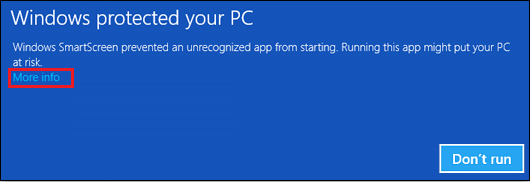
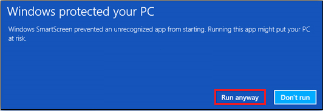
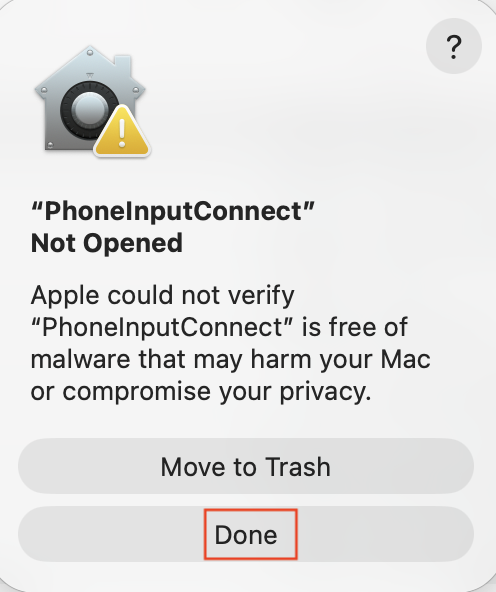
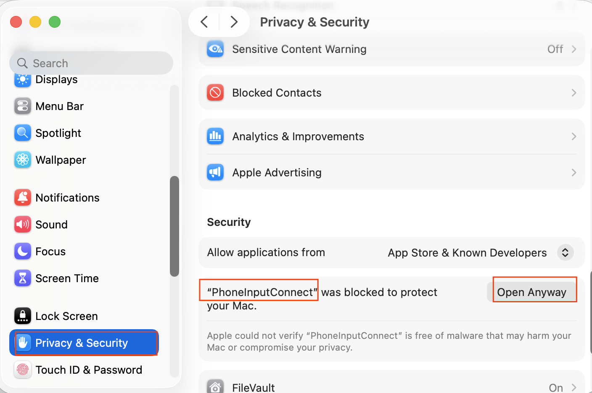
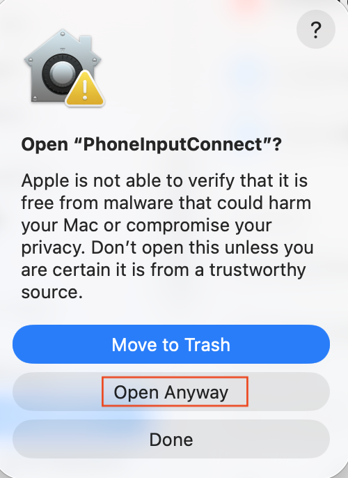
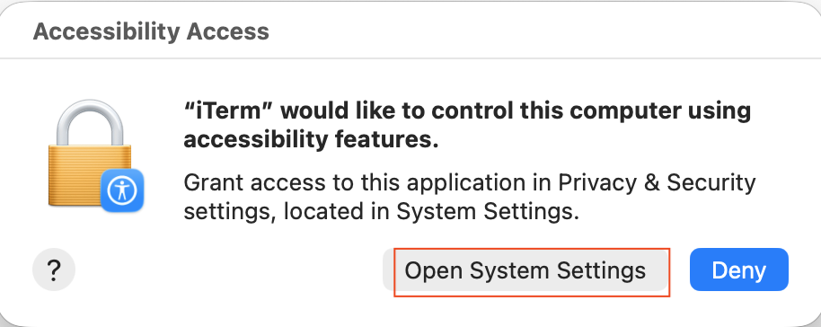
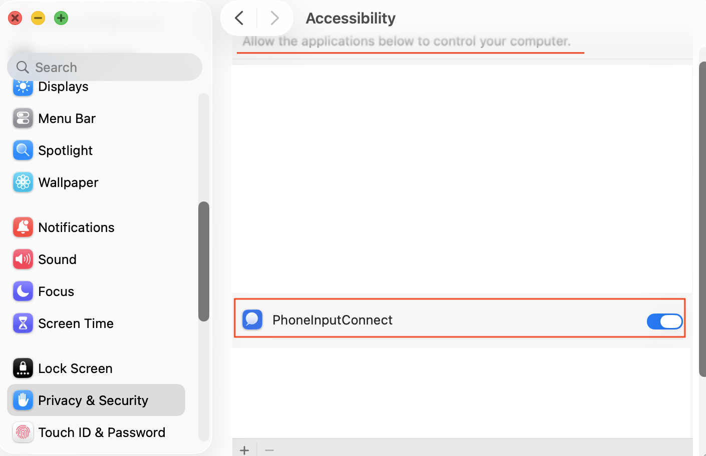
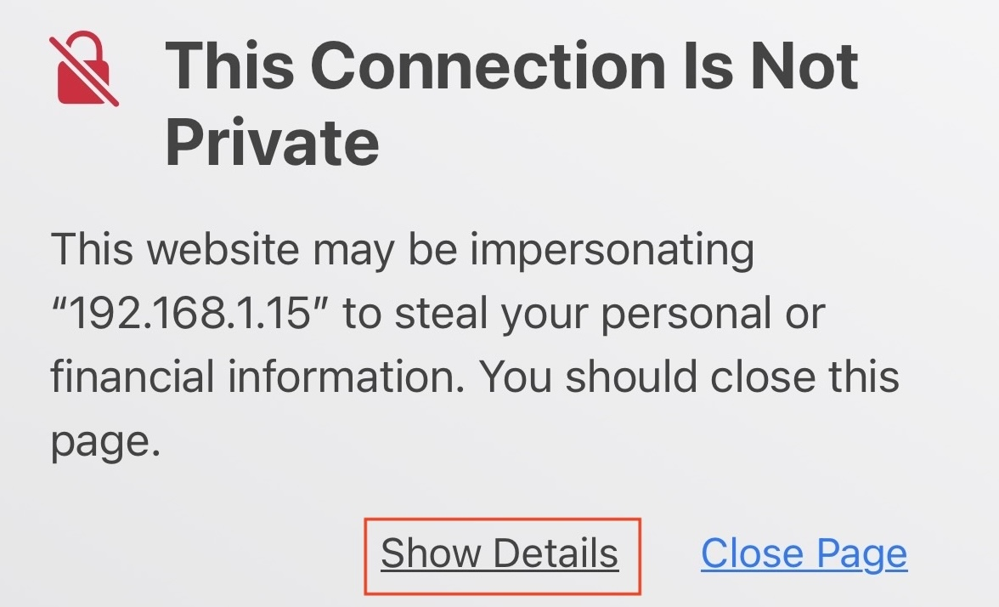
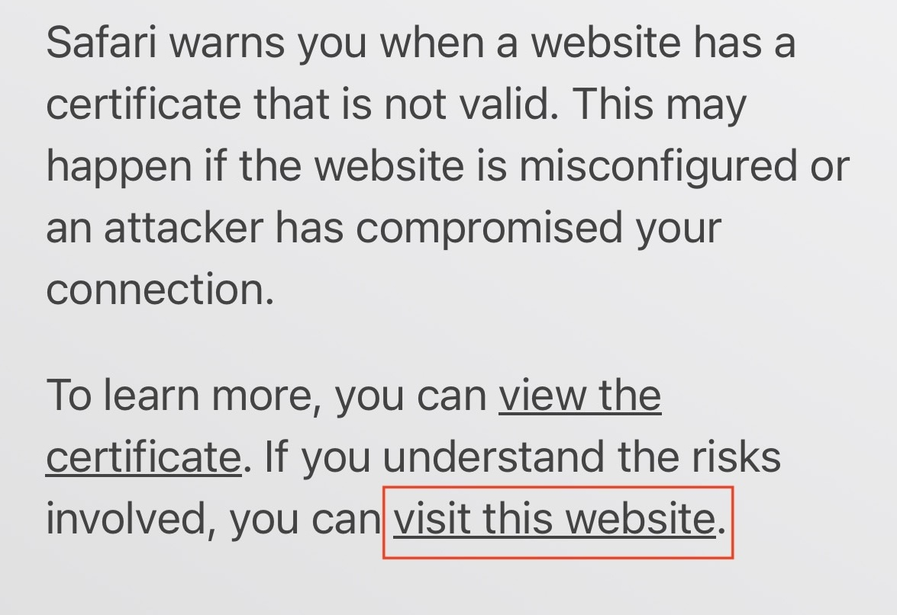
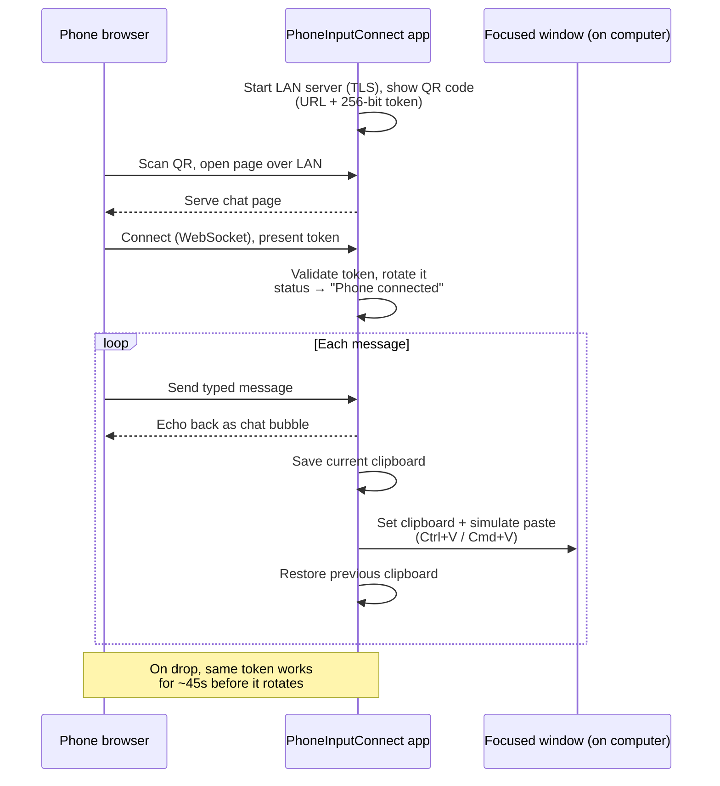

# PhoneInputConnect

Type on your desktop by texting it from your phone.

PhoneInputConnect runs as a small app on your computer. It shows a QR code; scan
it with your phone (same Wi-Fi network, no app install), type a message in
the page that opens, and it's instantly typed into whatever window has
focus on your desktop -- as if you'd typed it yourself.

Works on **Linux, Windows, and macOS** — each opens a small native window with
the QR code, status, and recent history. No account, no cloud, no phone app.
All three platforms are built and tested on real hardware.

> 🌐 **[Read this in your language →](https://iravan.github.io/phone-ime-connect/)**
> — English · 繁體中文 · 简体中文 · 日本語 · 한국어

---

**Contents**

- [Why](#why) — what it's for and who it's for
- [For users](#for-users-no-building-required) — download and run (no building)
- [Common problems & fixes](#common-problems--fixes) — first-run blockers, with screenshots
- [How it works](#how-it-works) — the message flow
- [Building and running](#building-and-running) — from source (developers)
- [Security](#security) · [Platform notes](#platform-notes)

---

## Why

Typing on a phone keyboard is often faster or more comfortable than reaching
for a desktop keyboard -- e.g. dictating a note with the phone's speech-to-text,
pasting a password or 2FA code from a phone-based manager, sending an emoji or
CJK phrase your desktop IME fumbles, or entering text one-handed from across the
room. The phone is already in your hand, already unlocked, already set up with
your preferred keyboard, autocorrect, and dictation. PhoneInputConnect turns it
into an ad hoc keyboard for whatever window you're focused on -- with no
account, no cloud service, and no app to install.

**The problem it solves:** on a computer, entering anything that isn't plain
English is painful -- switching input methods, a mouse-driven handwriting pad,
candidate-list hunting, or dictation in the few apps that support it -- yet the
best keyboard you own (your phone) can't reach your computer's apps. **The goal:
let your phone type into any program on your computer, with zero setup and
nothing ever leaving your network.**

> **The killer use case: voice dictation.** Modern phones have excellent, fast,
> on-device speech-to-text -- usually far better than what your desktop offers,
> especially for non-English or mixed-language speech. With PhoneInputConnect you
> tap the mic on your phone keyboard, talk, and the recognized text lands in
> **any** desktop app -- your editor, chat box, terminal, search bar, a form --
> not just apps that happen to support dictation. It effectively gives every
> program on your computer a voice-input button, powered by the best recognizer
> you already carry. Dictate a long message, an email, a commit description, or
> a paragraph of notes hands-free, then keep working at the desktop.

**Who this is for:**

- **CJK / complex-script users** who type Chinese, Japanese, Korean, Thai, etc.
  far more comfortably on their phone's handwriting/stroke/voice IME than through
  a desktop input method.
- **Handwriting-only users** who can *write* or draw a character by hand but
  never learned a typing input method (Pinyin, Zhuyin, Cangjie, romaji…) -- the
  phone's handwriting recognition lets them just draw each character, no scheme
  to memorize.
- **Users on older computers** whose OS no longer ships (or never had) an input
  method they relied on -- a dropped legacy IME, a language pack that isn't
  installed, or a script the machine simply can't type. The phone supplies the
  input the computer is missing, without installing anything on it.
- **Heavy phone typists** with years of swipe/prediction muscle memory who are
  simply faster on their phone than on a physical keyboard.
- **Voice-input users** who want to dictate into any desktop app using their
  phone's superior speech-to-text.
- **Accessibility users** for whom a touch keyboard, handwriting, or voice is
  easier than a desktop keyboard, or who type more comfortably one-handed.
- **Privacy-conscious, cross-ecosystem users** who want a local, no-account tool
  that works between *any* phone and *any* desktop OS.
- **Tinkerers** who prefer a small, inspectable open-source utility with zero
  setup.

<details>
<summary>The philosophy — and how it compares to built-in OS features</summary>

**The phone is now the primary text-input device.** It's always in hand, and
manufacturers pour huge effort into its IME (input method editor): swipe typing,
prediction and autocorrect, per-language layout tuning, handwriting recognition,
and top-tier voice input. Years of daily use build real muscle memory — many
people are faster and more accurate on their phone than on a desktop keyboard.

**The gap is widest for stroke-based and complex scripts.** Entering Chinese on a
desktop is genuinely awkward: install and configure an input method, pick a
scheme (Pinyin, Zhuyin, Cangjie, Wubi, stroke…), and juggle candidate lists with
the keyboard — and handwriting with a mouse is painful. Phones handle it out of
the box: on-screen handwriting, stroke/radical input, swipe, and voice all just
work, tuned by the vendor for that exact script. The same holds for Japanese,
Korean, Thai, emoji, and mixed-language text.

**So the philosophy is humble: don't reinvent the input method — relay the one
the user already trusts.** Rather than build yet another desktop IME,
PhoneInputConnect lets the phone do what it's best at and delivers the finished
text to whatever has focus on your computer. The tool should be invisible: the
phone's keyboard is the product; this just carries its output across the room.

**How it compares to built-in OS features.** Phone-as-input is becoming a
standard ecosystem feature — vendors are baking text hand-off, shared clipboard,
and continuity-style input into their desktops. PhoneInputConnect's niche is
narrower and different:

| | Built-in OS features | PhoneInputConnect |
|---|---|---|
| Setup | Accounts + linked devices | Scan a QR code |
| Devices | Usually same vendor only | Any phone → any desktop OS |
| Data path | Often via the cloud | Local LAN only, encrypted |
| Openness | Opaque OS subsystem | One small open-source binary |

If you live entirely inside one vendor's ecosystem, their built-in feature may
already cover you. PhoneInputConnect is for everyone who doesn't — or who just
wants a tool they can read, run, and trust without an account.

</details>

<details>
<summary>Beyond the desktop: consoles, karaoke, TVs — any display-only device</summary>

This desktop app is just one instance of a much broader idea. **Any device that
is essentially a display plus a cursor — but no real keyboard — has a text-input
problem**, and the same phone-relay concept solves it. If you build for these
devices, this is worth stealing.

Think about how painful text entry is today on:

- **Game consoles (PlayStation, Xbox, Switch).** Typing a search query,
  username, password, friend message, or Wi-Fi key by nudging a thumbstick
  across an on-screen keyboard one letter at a time is one of the most-complained
  about experiences in gaming. A phone-relay turns it into: scan, type, done.
- **Karaoke machines.** Finding a song means scrolling an on-screen keyboard with
  a remote — and it's *especially* brutal for **Chinese/Japanese/Korean song
  titles**, where a D-pad has no good way to enter the characters at all. A phone
  brings full CJK IME, handwriting, **and voice search** ("just say the song
  name") to a device that otherwise can't do any of it.
- **Smart TVs & streaming boxes** (login, search), **kiosks and POS terminals**,
  **VR/AR headsets**, and **car infotainment** — all the same story: a great
  display, a clumsy pointer, and no keyboard.

Why the phone-relay pattern wins here:

- **The best keyboard is already in every user's pocket** — with the IME, voice
  recognition, autocorrect, and language support the vendor spent years tuning.
  Don't try to out-build it on a D-pad; borrow it.
- **Voice and CJK become trivial.** The hardest inputs for a cursor-only device
  (long text, dictation, stroke-based scripts) are exactly what phones do best.
- **Cheap to implement and cross-vendor.** The whole mechanism is a QR code, a
  tiny local web page, a WebSocket, and injecting the received text — no app to
  ship to an app store, no account system, works with any phone.
- **Zero install for the user.** Scan and type; nothing to download on either
  side.

And it **deploys at scale**: from a single desktop to public kiosks, a row of
arcade cabinets, a karaoke venue's booths, digital signage, or a whole fleet of
shared terminals — one phone-relay endpoint per screen.

The takeaway for device makers and hobbyists alike: **stop trying to make an
on-screen keyboard less bad. Let the phone be the keyboard.** PhoneInputConnect
is the desktop proof of concept — the same few moving parts drop straight into a
console, a karaoke box, or a kiosk.

> **Scope:** this repository implements **only the desktop tool**. The consoles,
> karaoke, kiosks, and larger fleet/venue-scale uses above are the *concept* —
> they are **not included here**, just an open invitation to build on it.

</details>


---

**🌐 Read the pitch in your language** — 繁體中文 · 简体中文 · 日本語 · 한국어 (click any to expand):

<details>
<summary>繁體中文</summary>

**用手機打字，直接輸入到電腦。** 在電腦上開啟這個小程式，它會顯示一個 QR code；用手機掃描（同一個 Wi‑Fi、不用安裝任何 App），在開啟的網頁輸入文字，內容就會即時輸入到電腦上目前作用中的視窗——就像你親手打的一樣。不需帳號、不經雲端、不用安裝手機程式。

**最強用途：語音輸入。** 現代手機的語音辨識又快又準，通常比電腦內建的更好，對非英語與中英夾雜尤其明顯。按下手機鍵盤的麥克風、開口說，辨識出的文字就會送進電腦上「任何」一個程式——編輯器、聊天框、終端機、搜尋列、表單——不限於支援聽寫的程式。等於替電腦上每個程式加上語音輸入。

**適合誰：** 使用中日韓等複雜文字的人（手機的手寫／筆劃／語音輸入遠比桌面輸入法順手）、只會手寫卻沒學過任何輸入法（拼音、注音、倉頡…）的人（手機手寫辨識讓你直接寫字，不用背輸入法）、使用舊電腦、系統已不再內建（或從未有過）某個慣用輸入法的人（手機補上電腦缺少的輸入方式，不必在電腦上安裝任何東西）、手機重度打字者、想用語音輸入到任何程式的人、有無障礙需求者，以及重視隱私、跨生態系的人。

**理念：不重造輸入法，而是把你早已信任的輸入法接過來。** 讓手機做它最擅長的事，再把完成的文字送到電腦上作用中的視窗。工具應該是隱形的——手機鍵盤才是主角，這只是把它的輸出傳到另一邊。

**不只桌面電腦。** 這個概念適用於任何「有螢幕、有游標、卻沒有好鍵盤」的裝置：遊戲主機、卡拉OK 點歌機、智慧電視、自助機台、VR 眼鏡、車載系統。在這些裝置上打字（搜尋、帳號密碼、訊息）向來很痛苦；卡拉OK 用遙控器點「中日韓歌名」更是幾乎無解。用手機一掃，就能帶來完整的中文輸入、手寫，甚至「用說的」點歌。而且它也能**大規模部署**：從單台電腦到公共自助機、卡拉OK 包廂、數位看板，甚至整個場館或車隊規模的共用終端。與其把螢幕鍵盤做得比較不爛，不如讓手機直接當鍵盤。

*範圍說明：本專案僅實作「桌面版」；上述遊戲主機、卡拉OK、自助機台與更大規模的應用只是概念，並未包含在此，歡迎自行延伸打造。*

</details>

<details>
<summary>简体中文</summary>

**用手机打字，直接输入到电脑。** 在电脑上打开这个小程序，它会显示一个二维码；用手机扫描（同一个 Wi‑Fi、无需安装任何 App），在打开的网页输入文字，内容就会实时输入到电脑上当前活动的窗口——就像你亲手打的一样。无需账号、不经云端、无需安装手机程序。

**最强用途：语音输入。** 现代手机的语音识别又快又准，通常比电脑自带的更好，对非英语与中英混合尤其明显。按下手机键盘的麦克风、开口说，识别出的文字就会送进电脑上“任意”一个程序——编辑器、聊天框、终端、搜索栏、表单——不限于支持听写的程序。等于给电脑上每个程序加上语音输入。

**适合谁：** 使用中日韩等复杂文字的人（手机的手写／笔画／语音输入远比桌面输入法顺手）、只会手写却没学过任何输入法（拼音、注音、仓颉…）的人（手机手写识别让你直接写字，不用背输入法）、使用旧电脑、系统已不再内置（或从未有过）某个惯用输入法的人（手机补上电脑缺少的输入方式，无需在电脑上安装任何东西）、手机重度打字者、想用语音输入到任意程序的人、有无障碍需求者，以及重视隐私、跨生态系统的人。

**理念：不重造输入法，而是把你早已信任的输入法接过来。** 让手机做它最擅长的事，再把完成的文字送到电脑上活动窗口。工具应当是隐形的——手机键盘才是主角，这只是把它的输出传到另一边。

**不只桌面电脑。** 这个概念适用于任何“有屏幕、有光标、却没有好键盘”的设备：游戏主机、卡拉OK 点歌机、智能电视、自助机、VR 眼镜、车载系统。在这些设备上打字（搜索、账号密码、消息）历来很痛苦；卡拉OK 用遥控器点“中日韩歌名”更是几乎无解。用手机一扫，就能带来完整的中文输入、手写，甚至“用说的”点歌。而且它也能**大规模部署**：从单台电脑到公共自助机、卡拉OK 包厢、数字看板，甚至整个场馆或车队规模的共用终端。与其把屏幕键盘做得没那么烂，不如让手机直接当键盘。

*范围说明：本项目仅实现“桌面版”；上述游戏主机、卡拉OK、自助机与更大规模的应用只是概念，并未包含在此，欢迎自行延伸打造。*

</details>

<details>
<summary>日本語</summary>

**スマホで入力し、そのまま PC へ。** PC で小さなアプリを起動すると QR コードが表示されます。スマホでスキャンし（同じ Wi‑Fi、アプリのインストール不要）、開いたページに文字を打つと、PC 側で今アクティブなウィンドウに即座に入力されます——自分でタイプしたのと同じように。アカウント不要、クラウド不要、スマホアプリ不要。

**一番の使いどころ：音声入力。** 最近のスマホの音声認識は速くて正確で、たいてい PC 内蔵のものより優秀です（特に非英語や混在言語）。スマホのキーボードのマイクを押して話すだけで、認識されたテキストが PC 上の「任意の」アプリ——エディタ、チャット、ターミナル、検索欄、フォーム——に入ります。ディクテーション対応アプリに限りません。

**こんな人に：** 中国語・日本語・韓国語など複雑な文字を使う人（手書き・画数・音声入力はスマホの方が断然快適）、入力方式（ローマ字・ピンイン・注音…）を覚えていないが手で書ける人（スマホの手書き認識でそのまま書ける）、古い PC で、OS がかつて使っていた入力方式をもう搭載していない（または最初から無い）人（スマホが PC に足りない入力手段を補う。PC には何もインストール不要）、スマホ入力に慣れた人、どんなアプリにも音声で入力したい人、アクセシビリティを重視する人、プライバシー重視で複数 OS を使う人。

**哲学：入力方式を作り直さない。ユーザーが既に信頼している入力方式を「中継」する。** スマホに得意なことをさせ、確定したテキストを PC のアクティブウィンドウへ届けるだけ。道具は透明であるべきで、主役はスマホのキーボードです。

**デスクトップだけではありません。** この考え方は「画面とカーソルはあるが、まともなキーボードがない」あらゆる機器に使えます：ゲーム機、カラオケ、スマート TV、キオスク端末、VR、車載システム。これらでの文字入力（検索・ID／パスワード・メッセージ）は昔から苦痛で、カラオケで「日本語・中国語・韓国語の曲名」をリモコンで探すのはほぼ不可能です。スマホをかざせば、完全な日本語入力・手書き、さらに「声で曲名を言う」検索まで可能に。しかも**大規模展開**も可能です：1 台の PC から、公共キオスク、カラオケの各ブース、デジタルサイネージ、さらには施設・車両群規模の共用端末まで。画面上のキーボードを少しマシにするより、スマホをキーボードにしましょう。

*スコープ：本リポジトリは「デスクトップ版のみ」を実装しています。上記のゲーム機・カラオケ・キオスク・より大規模な用途は概念であり、ここには含まれません。自由に発展させてください。*

</details>

<details>
<summary>한국어</summary>

**휴대폰으로 입력해 PC에 그대로.** PC에서 작은 앱을 실행하면 QR 코드가 표시됩니다. 휴대폰으로 스캔하고(같은 Wi‑Fi, 앱 설치 불필요) 열린 페이지에 입력하면, PC에서 현재 활성화된 창에 즉시 입력됩니다——직접 타이핑한 것처럼요. 계정 없음, 클라우드 없음, 휴대폰 앱 없음.

**최고의 활용: 음성 입력.** 요즘 휴대폰의 음성 인식은 빠르고 정확하며, 보통 PC 기본 기능보다 낫습니다(특히 비영어·혼합 언어). 휴대폰 키보드의 마이크를 누르고 말하면 인식된 텍스트가 PC의 「어떤」 앱에든——편집기, 채팅, 터미널, 검색창, 양식——들어갑니다. 받아쓰기를 지원하는 앱에 국한되지 않습니다.

**이런 분께:** 중국어·일본어·한국어 등 복잡한 문자를 쓰는 분(손글씨·획·음성 입력은 휴대폰이 훨씬 편합니다), 입력기(병음·주음·로마자…)는 몰라도 손으로 쓸 수는 있는 분(휴대폰 손글씨 인식으로 그냥 쓰면 됩니다), 오래된 컴퓨터라 OS에 예전에 쓰던 입력기가 더 이상 없거나(처음부터 없던) 분(휴대폰이 컴퓨터에 없는 입력 수단을 보완하며, 컴퓨터에는 아무것도 설치할 필요가 없습니다), 휴대폰 입력에 익숙한 분, 어떤 앱에든 음성으로 입력하고 싶은 분, 접근성이 중요한 분, 프라이버시와 크로스 생태계를 중시하는 분.

**철학: 입력기를 새로 만들지 않고, 사용자가 이미 신뢰하는 입력기를 '중계'합니다.** 휴대폰이 잘하는 일을 하게 하고, 완성된 텍스트를 PC의 활성 창에 전달할 뿐입니다. 도구는 보이지 않아야 하며, 주인공은 휴대폰 키보드입니다.

**데스크톱만이 아닙니다.** 이 개념은 「화면과 커서는 있지만 제대로 된 키보드가 없는」 모든 기기에 적용됩니다: 게임 콘솔, 노래방 기기, 스마트 TV, 키오스크, VR, 차량 인포테인먼트. 이런 기기에서의 텍스트 입력(검색·아이디／비밀번호·메시지)은 늘 고통스럽고, 노래방에서 리모컨으로 「중국어·일본어·한국어 곡명」을 찾는 건 사실상 불가능합니다. 휴대폰으로 스캔하면 완전한 한글 입력, 손글씨, 나아가 「음성으로 곡명 말하기」 검색까지 가능해집니다. 게다가 **대규모로 배포**할 수도 있습니다: PC 한 대에서 공공 키오스크, 노래방 각 룸, 디지털 사이니지, 나아가 시설·차량군 규모의 공용 단말까지. 화면 키보드를 덜 나쁘게 만들기보다, 휴대폰을 키보드로 삼으세요.

*범위: 이 저장소는 「데스크톱 버전만」 구현합니다. 위의 게임 콘솔·노래방·키오스크 및 더 큰 규모의 용도는 개념이며 여기에는 포함되지 않습니다. 자유롭게 발전시키세요.*

</details>

## For users (no building required)

If you just want to use the app, grab a prebuilt download — you don't need
Rust or any of the developer setup below.

**1. Download** the build for your system from [Releases](../../releases):

- **macOS** — an Apple Silicon `.app`. Move it to Applications (or run in place).
- **Windows** — an `.exe`. Run it directly.
- **Linux** — a `.deb` (Debian/Ubuntu, incl. Zorin OS) or `.rpm` (Fedora), both
  x86_64. The app icon and launcher entry are set up for you on install.

**Minimum versions (prebuilt downloads):**

- **macOS 11 Big Sur or later**, Apple Silicon (the prebuilt `.app` is arm64;
  Intel Macs need to build from source).
- **Windows 10 or later**, 64-bit (x86_64).
- **Linux**, x86_64, with **GTK 4.6+** (e.g. Ubuntu 22.04 / Debian 12 /
  Fedora 36 or newer). On X11 the paste keystroke also needs `libxdo`.

**2. Get past the first-run warning.** New downloaded software triggers a
one-time security prompt — this is normal for any app not from a big publisher:

- **Windows** ("Windows protected your PC"): click **More info** → **Run anyway**.
- **macOS** ("Apple could not verify…" or "app is damaged"): releases are
  ad-hoc signed (not yet notarized), so Gatekeeper blocks them. In Terminal run
  `xattr -cr /Applications/PhoneInputConnect.app` then
  `codesign --force --deep --sign - /Applications/PhoneInputConnect.app`, and
  open it (see [fix #2](#2-macos-wont-open--apple-could-not-verify-or-app-is-damaged)).
  Then, so it can type into other apps, approve the Accessibility prompt once
  (**System Settings → Privacy & Security → Accessibility**) — until you do,
  messages arrive but nothing gets typed.
- **Linux** (some GNOME setups): allow the one-time "remote desktop
  interaction" prompt the first time a message is typed.

**3. Use it.** Launch the app, scan the QR code with your phone's camera (same
Wi-Fi as the computer), tap through the one-time "connection is not private"
warning in the phone's browser, then type and send. Your message is typed into
whatever window is focused on the computer. "New code" makes a fresh QR code;
"Clear history" wipes the on-screen list.

Hit a snag? See **[Common problems & fixes](#common-problems--fixes)** below —
it walks through every blocker you're likely to see, with screenshots.

Your privacy: everything stays on your local Wi-Fi (no account, no cloud), the
connection is encrypted, only one phone can connect per code, and nothing is
saved to disk — message history lives in memory and is gone when you close the
app.

## Common problems & fixes

The blockers below are the ones almost every first-time user hits. Each is
normal and each has a quick fix. Screenshots show exactly what you'll see.

### 1. Windows: "Windows protected your PC"

<details>
<summary>Show fix &amp; screenshots</summary>

**When:** the very first time you run the downloaded `.exe`.
**Why:** the app is unsigned, so Windows SmartScreen warns about any new,
downloaded program from an unknown publisher — it's not about this app
specifically.






**Fix:** click **More info**, then the **Run anyway** button that appears.
(Alternatively: right-click the file → **Properties** → tick **Unblock** → **OK**.)

</details>

### 2. macOS: won't open — "Apple could not verify…" or "app is damaged"

<details>
<summary>Show fix &amp; screenshots</summary>

**When:** first time you open a downloaded `.app`.
**Why:** the current release builds are **ad-hoc signed, not notarized** (the
project doesn't yet have an Apple Developer signing certificate configured), so
macOS Gatekeeper blocks them. On **macOS 15 Sequoia and newer**, Apple also
removed the old right-click → **Open** shortcut, so double-clicking now fails
silently or says the app "is damaged and can't be opened" — even though it
isn't.

**Fix — the reliable way (Terminal).** Move the app to your Applications folder
first, then run these two commands (adjust the path if it's elsewhere):

```sh
xattr -cr /Applications/PhoneInputConnect.app                       # remove the download quarantine
codesign --force --deep --sign - /Applications/PhoneInputConnect.app  # re-apply a valid local signature
```

Then double-click the app as normal. This only needs doing once. `xattr -cr`
clears the "downloaded from the internet" mark that makes Gatekeeper refuse it;
the `codesign` line re-seals the app for your own machine, which fixes the "app
is damaged" case that quarantine removal alone sometimes doesn't.

**Fix — GUI only (may not be enough on Sequoia).** Double-click once (it gets
blocked), then **System Settings → Privacy & Security**, scroll to the blocked
message and click **Open Anyway**. On macOS 14 and earlier you can instead
right-click the app → **Open** → **Open**.

> The permanent fix is on the project side: signing and notarizing releases (the
> release workflow already supports it — it just needs the Apple Developer
> secrets configured). Until then, the steps above are required for every
> download.





</details>

### 3. macOS: messages arrive but nothing gets typed

<details>
<summary>Show fix &amp; screenshots</summary>

**When:** after connecting, the phone shows the message delivered but no text
appears on the computer.
**Why:** typing into other apps needs **Accessibility** permission, which macOS
withholds until you grant it.


**Fix:** approve the "PhoneInputConnect would like to control this computer"
prompt on first launch, or turn it on manually under **System Settings →
Privacy & Security → Accessibility**.




</details>

### 4. Phone: "Your connection is not private"

<details>
<summary>Show fix &amp; screenshots</summary>

**When:** right after scanning the QR code, in the phone's browser.
**Why:** the link is encrypted with a certificate your computer generated
itself — safe on your own network, but browsers flag self-signed certificates.


**Fix:** tap **Advanced** (or **Show details**) → **Proceed / Continue**. Once
per phone.



</details>

### 5. Phone can't open the page at all

<details>
<summary>Show fix</summary>

**When:** the QR scans but the page never loads, or times out.
**Why:** the phone and computer aren't on the same network, or the QR encodes
the wrong address.

**Fix:**
- Make sure the phone and computer are on the **same Wi-Fi network** (not
  guest Wi-Fi, not mobile data).
- If they are and it still fails, the app may have guessed the wrong network
  address. Find your computer's Wi-Fi IPv4 address and set the environment
  variable `PHONE_INPUT_CONNECT_LAN_IP` to it before launching, e.g.
  `PHONE_INPUT_CONNECT_LAN_IP=192.168.1.42`.

</details>

### 6. Linux/Wayland: typing silently does nothing

<details>
<summary>Show fix</summary>

**When:** on Linux, the message is "delivered" but no text appears.
**Why:** many Wayland desktops block apps from simulating keystrokes as a
security measure — nothing this app can override.

**Fix:** the message is still sitting on your clipboard — just press
**Ctrl+V** yourself in the target window. (Some GNOME setups also show a
one-time "allow remote desktop interaction" prompt the first time; allow it.)

</details>

> **Adding the screenshots:** the images above live in `docs/screenshots/`.
> That folder's `README.md` lists exactly what each screenshot should capture —
> drop the PNGs in with the matching filenames and they'll render here.

## How it works

<details>
<summary>Show the message flow &amp; details</summary>



1. Launch PhoneInputConnect. A window showing a QR code opens directly --
   a GTK4 window on Linux, a Win32 window on Windows, native AppKit
   widgets on macOS (which also gets a menu-bar icon). This window is the
   only UI; there's no browser-based fallback.
2. Scan the QR code with your phone's camera. It opens a chat-style page
   served directly from your computer over your LAN.
3. Type a message on your phone and hit send. It's echoed back to your
   phone as a chat bubble, and delivered into the desktop's currently
   focused window by placing it on the clipboard and simulating a paste
   (Ctrl+V, or Cmd+V on macOS) -- your previous clipboard contents are
   restored right after.
4. The window updates live: it shows "Phone connected" and a rolling
   history of the last few messages sent (with a "Clear history" button
   on Linux and Windows to wipe that history early).

The desktop window's own text (status/hint/button labels) is shown in
English or Traditional Chinese, picked automatically from the OS's UI
language at startup (`src/i18n.rs`) -- no setting to change it. The phone
page (`src/webapp/chat.html`) is unrelated to this: it localizes itself from
the *phone's* browser language instead, since the phone and desktop are
different devices with no reason to share a UI language.

Only one phone can be paired at a time. Scanning a new QR code (the
window's "New code" button) invalidates the old one.

If the phone's connection drops (screen lock, backgrounded browser tab,
brief Wi-Fi blip), the same QR code/URL keeps working for about 45 seconds
in case it reconnects on its own -- no need to re-scan for a short hiccup.
Past that window, the code is invalidated for good and needs a fresh scan.

The window itself *is* the app on every platform, so there's nothing to
lose track of. Relaunching while an instance is already running just logs
that it's already up rather than starting a second one or bringing the
existing window forward. (On macOS, where closing hides the window rather
than quitting, the menu-bar icon's "Show window" brings it back.)

</details>

## Building and running

Requires a recent Rust toolchain (`cargo build`/`cargo run`).

### Linux

<details>
<summary>Show Linux build steps</summary>

The window is a native [GTK4](https://docs.rs/gtk4) UI (GTK 4.6 or newer),
which needs GTK4's development packages to build:

```sh
# Fedora
sudo dnf install gtk4-devel
# Debian/Ubuntu (including derivatives like Zorin OS)
sudo apt install libgtk-4-dev
```

Targeting Zorin OS 17 (Ubuntu 22.04 base, GNOME-based Core/Pro edition)
specifically: its system GTK4 is version 4.6, so the code deliberately
stays within GTK 4.6 APIs rather than something newer, even though this
repo is otherwise built and tested against a much newer GTK4 -- not yet
confirmed working on actual Zorin hardware, just built to be compatible
with what it ships. On an *older* base than that (Zorin OS 16 / Ubuntu
20.04 or earlier), `libgtk-4-dev` may not be in the default repos at all,
since GTK4 was still quite new then; you'd need a PPA or a newer release.

Typing uses [`enigo`](https://docs.rs/enigo) (for the paste keystroke),
which on X11 links against `libxdo`, so that needs to be installed too:

```sh
# Fedora
sudo dnf install libxdo-devel
# Debian/Ubuntu
sudo apt install libxdo-dev
```

Then:

```sh
cargo run
```

**Optional -- a proper icon in the dock/taskbar/Alt-Tab**: GTK4 under
Wayland has no in-process way to set a window icon; it's resolved
entirely from a `.desktop` file matched by application ID, not anything
the app itself can set at runtime. Without one installed, the window
just gets a generic icon. To fix that:

```sh
cargo build --release
./scripts/install-linux-desktop-entry.sh
```

The icon then applies whether you launch from your app launcher/dock or
just run the binary directly -- GNOME matches by application ID either
way. Re-run the script if you move the checkout, since the binary's path
is baked into the installed entry as-is.

**`.deb` and `.rpm` packages**, with the icon/desktop entry handled
properly (an installed icon theme entry rather than an absolute path,
standard `/usr/bin` install), are built automatically for x86_64 on
every tagged release -- see [Releases](../../releases) for prebuilt
ones, or run `cargo install cargo-deb && cargo deb` /
`cargo install cargo-generate-rpm && cargo build --release && cargo generate-rpm`
yourself. That needs to run on an actual x86_64 machine: this project is
developed on aarch64, which can't reliably cross-compile a
GTK4/libxdo-linked binary for x86_64 (see
`.github/workflows/release.yml`, which builds the `.deb` on a real
x86_64 Ubuntu GitHub Actions runner and the `.rpm` inside an actual
Fedora container, so each package's automatic dependency detection
reflects its own ecosystem's real conventions).

</details>

### Windows

<details>
<summary>Show Windows build steps</summary>

The window is a native [`native-windows-gui`](https://docs.rs/native-windows-gui)
(Win32) UI. No extra system packages are required -- `cargo run` builds
and runs as normal. Built and tested on real Windows hardware; requires
the `native-windows-gui` crate's `image-decoder` feature (already set in
this repo's `Cargo.toml`) for the QR code to actually render -- without
it, `Bitmap::builder().source_bin(...)` can't decode the PNG bytes the QR
image is generated as.

History doesn't have the Linux window's per-row hover-to-copy button --
`native-windows-gui`'s plain controls don't support per-item interactive
widgets without a much larger owner-drawn-ListView undertaking. Instead
it's a read-only text box with a "Copy last message" button and a
"Clear history" button.

**SmartScreen warning ("Windows protected your PC")**: a prebuilt `.exe`
downloaded from this repo's [Releases](../../releases) page is unsigned,
so Windows shows this generic warning the first time it's run, regardless
of the binary's actual behavior -- new, unsigned software from an
unrecognized publisher gets it by default until enough people have
run it (or until it's signed with a paid code-signing certificate). To
run it anyway: click **More info**, then **Run anyway**; or right-click
the downloaded file → Properties → check **Unblock** → OK, then run it.
Building from source with `cargo build --release` instead avoids the
warning entirely, since the binary was compiled locally rather than
downloaded.

</details>

### macOS

<details>
<summary>Show macOS build steps</summary>

The window is drawn with native AppKit widgets via
[`objc2`](https://docs.rs/objc2) (`NSStackView` of
`NSTextField`/`NSImageView`/`NSButton`), hosted in a
[`winit`](https://docs.rs/winit) window with a
[`tray-icon`](https://docs.rs/tray-icon) menu-bar icon. No extra system
packages are required -- `cargo run` builds and runs as normal.

**Build a double-clickable app**: `cargo run` is fine for development,
but to get a normal app users launch from Finder/Dock (no terminal),
build the bundle:

```sh
./scripts/build-macos-app.sh   # -> target/release/PhoneInputConnect.app
```

Move `PhoneInputConnect.app` to `/Applications` (or run it in place).
Delivering messages into other apps simulates a Cmd+V keystroke, which
macOS gates behind **Accessibility** permission: the first launch pops a
"PhoneInputConnect would like to control this computer" prompt -- approve
it once (System Settings > Privacy & Security > Accessibility) and it
sticks to the app. Running the bare binary instead (e.g. `cargo run`)
can't hold that grant on its own; it borrows the *launching terminal's*
Accessibility permission, so the packaged app is the supported way to
run it. Prebuilt Apple Silicon (arm64) `.app` bundles are attached to
each tagged [release](../../releases) (see
`.github/workflows/release-macos.yml`).

**Gatekeeper**: when the release-signing secrets are configured (see the
workflow header), release builds are Developer ID signed and notarized,
so a downloaded `.app` opens normally. An *un-notarized* build (an
ad-hoc `.app`, e.g. one you built yourself or a release cut before
notarization was set up) is blocked on first open with "Apple could not
verify ... is free of malware". To open it anyway, strip the download
quarantine flag:

```sh
xattr -dr com.apple.quarantine /path/to/PhoneInputConnect.app
```

(or right-click the app → Open, or approve it under System Settings >
Privacy & Security > "Open Anyway").

**Picking the LAN address** (any platform): the QR must encode an address
the phone can actually reach. The app prefers a physical Wi-Fi/Ethernet
interface and skips VPN/tunnel interfaces automatically, but if it still
guesses wrong (unusual multi-interface setups), set
`PHONE_INPUT_CONNECT_LAN_IP` to the right IPv4 address to override
detection.

</details>

## Security

<details>
<summary>Show the security model</summary>

PhoneInputConnect is designed to be safe to run on an ordinary home or office Wi-Fi
network, where other devices are untrusted:

- The phone-facing listener binds only to this machine's detected LAN
  address -- never `0.0.0.0` -- and refuses to start at all if no such
  address can be found, so it's never accidentally more exposed than
  intended.
- The LAN hop is TLS-encrypted with a self-signed certificate generated on
  first run and cached per-user. Since there's no certificate authority
  behind it, your phone's browser will show a one-time "connection is not
  private" warning -- click through it once per phone.
- Pairing is gated by a single 256-bit random token embedded in the QR
  code's URL. It's unguessable, and is rotated the instant a phone *first*
  successfully connects, so a QR code can't be reused to open a second,
  competing session. It also expires on its own after 5 minutes if nothing
  ever connects. A *disconnect*, by contrast, doesn't rotate the token
  immediately -- it opens a ~45-second grace window where the same token
  still works, so a phone tab surviving a brief drop can reconnect without
  a new scan; the token only rotates for real once that window elapses.
- Only one phone may be connected at a time.
- Repeated failed-token requests from a given source IP are rate-limited
  (defense in depth against scanning or log-spam, not against
  brute-forcing 256 bits of entropy, which is already computationally
  infeasible).
- There's only ever one listening socket -- the phone-facing one above.
  An earlier version also served an HTML "dashboard" page on a second,
  loopback-only socket (`127.0.0.1`) as a browser-based fallback for
  viewing the QR code/status/history; that's gone now that every
  platform has its own native window, fed the same status/history
  updates directly in-process (the GTK, Win32, and AppKit widgets are
  all fed straight from the snapshot stream, no network connection
  involved).
- Nothing is persisted to disk. Chat history is an in-memory ring buffer
  (the last 10 messages) that vanishes the moment the app stops.
- Each message is placed on the system clipboard just long enough to paste
  it into the focused window, then your previous clipboard contents are
  restored. Anything else on your machine that happens to poll the
  clipboard during that brief window could observe the message in transit.

</details>

## Platform notes

<details>
<summary>Show per-platform notes</summary>

- **Wayland**: most compositors block synthetic input (both the clipboard
  write and the Ctrl+V keystroke) from arbitrary clients as a security
  measure. On Wayland, PhoneInputConnect's typing may silently do nothing even
  though the phone shows the message as delivered. This is a compositor
  policy, not something PhoneInputConnect can work around. If the paste keystroke
  doesn't land, the message is still sitting on the clipboard -- a manual
  Ctrl+V/Cmd+V works as a fallback.
- **First keystroke on GNOME/Mutter (Wayland sessions)**: newer Mutter
  versions gate synthetic input -- including the legacy
  XTest-via-XWayland path `enigo` uses here -- behind the
  `RemoteDesktop` portal's consent dialog, even in an otherwise-X11/
  Xwayland session. Expect a one-time "allow remote desktop
  interaction"-style prompt the first time PhoneInputConnect actually sends a
  keystroke; typing works normally after it's granted. Distributions
  that default to a plain Xorg session (no Wayland/Mutter involved at
  all) shouldn't see this prompt in the first place -- Zorin OS has
  historically defaulted to Xorg for broader hardware/driver
  compatibility, for instance, though this isn't independently
  confirmed for the exact version you're running; check with
  `echo $XDG_SESSION_TYPE`.
- Delivery works by placing the message on the clipboard and simulating a
  paste, specifically *because* simulating individual keypresses (the
  previous approach, via `libxdo` on Linux) only has keycodes for the
  physical keyboard layout: non-Latin text (CJK, etc.) needed a synthetic
  Unicode keysym trick that most IMEs -- built to interpret real keystrokes
  as composition input, not to accept a pre-composed character outright --
  would silently drop or mangle. Pasting sidesteps that entirely.
- **macOS native window**: native AppKit widgets in a `winit` window with
  a menu-bar icon (`src/tray/native.rs`, `src/tray/appkit_dashboard.rs`). The app
  runs under the "Regular" activation policy (a Dock icon), so it behaves
  like an ordinary windowed app; closing the window hides it and leaves
  the app in the menu bar rather than quitting. The paste keystroke needs
  Accessibility permission (see the macOS build section); until it's
  granted, messages arrive but typing into other apps silently does
  nothing.
- **Windows**: `src/window/windows.rs` has now been built and tested on real
  Windows hardware, same as the Linux and macOS windows. It does need the
  `native-windows-gui` crate's `image-decoder` feature enabled (see the
  Windows build section above) -- without it, the QR code silently fails
  to render even though everything else in the window works.

</details>
